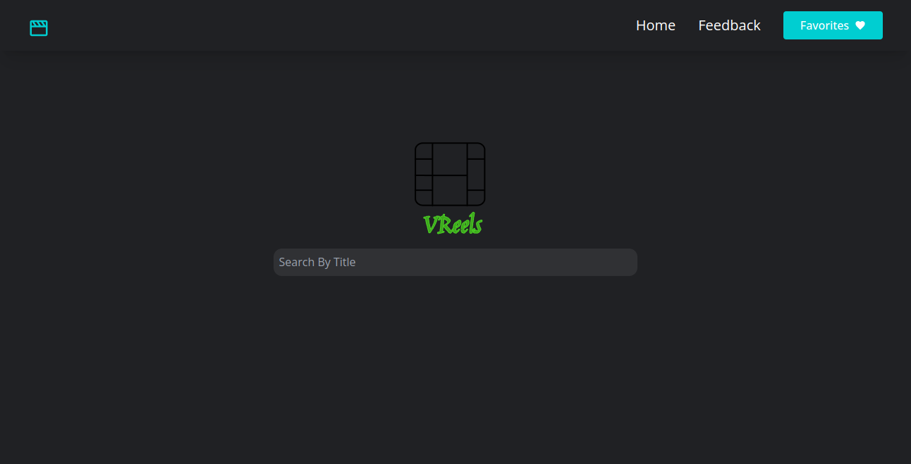
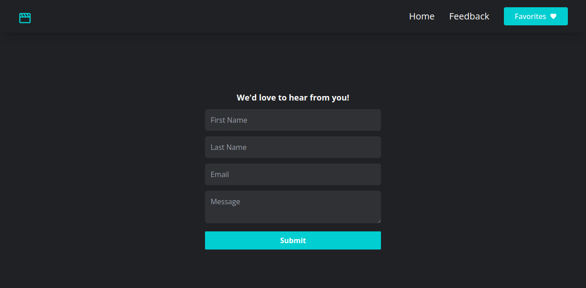
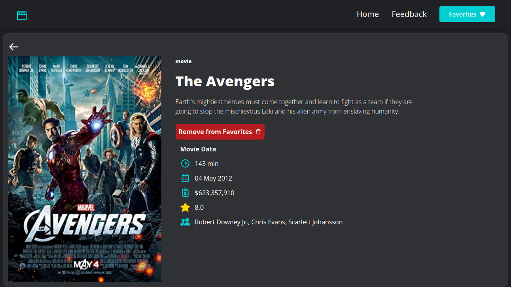

# Vreel Movie App.

- A movie application that allows users to search for movies, view movie details including lead actors and acressses, budgets, runtime, release date and Box Office earnings.

- The application gives feedback via toasts when the feedback is submitted, when a movie is added to favorites and when a movie is removed from favorites.

## Technologies Used

- React
- Typescript
- Redux Toolkit
- Tailwind CSS
- React Router v6
- React icons
- React Toastify

## Running the app locally

- Clone the app from the github repo by running the following command on your terminal:
  `git clone https://github.com/vicowiti/movie-rdx.git`.

- Install project dependencies by running: `yarn` in the project's home directory.

- To open the application in you local development environment, run: `yarn dev`.
- This will start the application on `http://localhost:5173` in your browser.

## The Application views

